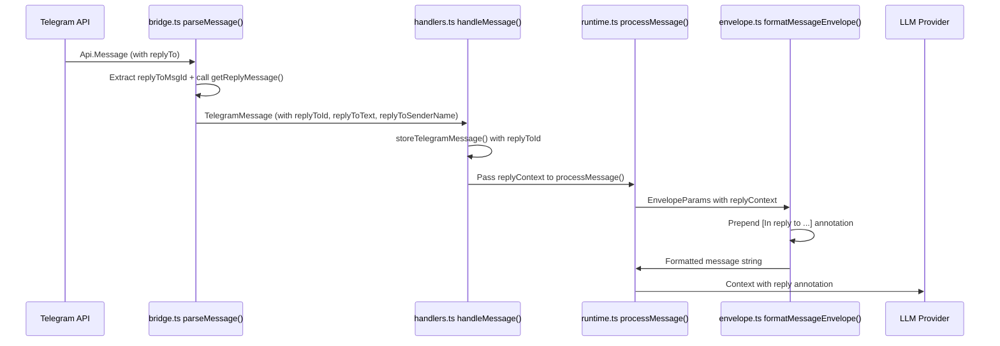

# Architecture: Reply Context Awareness

## Overview
Extract `replyTo.replyToMsgId` from incoming GramJS messages, resolve the replied-to message text (DB first, Telegram API fallback), and inject an `[In reply to ...]` annotation into the message envelope before it reaches the LLM.

## Data Flow



## Components

### 1. Bridge — Extract reply metadata (lightweight, no API call)
- **Location:** `src/telegram/bridge.ts:259-357` (parseMessage)
- **Changes:**
  - Add `replyToId?: number` to `TelegramMessage` interface (line 8)
  - In `parseMessage()`, use GramJS getter: `const replyToMsgId = msg.replyToMsgId;` — just the integer, NO API call
  - **CRITICAL:** Change `_rawMessage` (line 355) from `hasMedia ? msg : undefined` to `hasMedia || replyToMsgId ? msg : undefined`. Without this, text-only replies lose the raw msg reference.
  - Return `replyToId: replyToMsgId` in the message object

### 1b. Bridge — Add `fetchReplyContext()` helper method
- **Location:** `src/telegram/bridge.ts` (new public method on TelegramBridge)
- **Changes:**
  - Add `async fetchReplyContext(rawMsg: Api.Message): Promise<{text?: string, senderName?: string, isAgent?: boolean} | undefined>`
  - Calls `rawMsg.getReplyMessage()` with 5s timeout (same pattern as `getSender()` at line 284-286)
  - Extracts text, sender name/username, and checks `isAgent` via `this.ownUserId`
  - Returns `undefined` if getReplyMessage() fails/times out (deleted messages, etc.)
  - **Only called by handlers when the agent will actually respond** — never for skipped/pending messages

### 2. Handlers — Resolve reply context ONLY when responding + persist replyToId
- **Location:** `src/telegram/handlers.ts:362-374` (processMessage call), `src/telegram/handlers.ts:458-463` (storeTelegramMessage)
- **Changes:**
  - In `storeTelegramMessage()`: pass `message.replyToId?.toString()` instead of `undefined` (line 463) — always persists the ID, cheap
  - In `handleMessage()`, **inside the `chatQueue.enqueue()` callback** (after `shouldRespond` has already been confirmed, ~line 330+):
    - If `message.replyToId` is set AND `message._rawMessage` exists, call `bridge.fetchReplyMessage(message._rawMessage)` to get text + sender
    - Build `replyContext` object and pass to `agent.processMessage()`
  - **Critical:** the `getReplyMessage()` API call happens ONLY inside the enqueue block, meaning it ONLY runs for messages the agent is going to respond to. Group messages that are "Not mentioned" never reach this code path.

### 3. Runtime — Accept and forward reply context
- **Location:** `src/agent/runtime.ts:168-234` (processMessage)
- **Changes:**
  - Add `replyContext?: { senderName?: string; text: string; isAgent?: boolean }` as 12th optional parameter
  - Pass `replyContext` to `formatMessageEnvelope()` via `EnvelopeParams` (line 222-234)

### 4. Envelope — Format the annotation
- **Location:** `src/memory/envelope.ts:3-121`
- **Changes:**
  - Add `replyContext?: { senderName?: string; text: string; isAgent?: boolean }` to `EnvelopeParams`
  - In `formatMessageEnvelope()`: if `replyContext` is present, return multi-line format:
    ```
    ${header}\n[↩ reply to ${sender}: "${truncatedText}"]\n${body}
    ```
    Instead of the normal single-line `${header} ${body}`.
  - Truncate `text` to 200 chars with `...` if longer
  - Use `sanitizeForPrompt()` on the quoted text (consistent with line 65)
  - Sender label: `"agent"` if `isAgent`, else `senderName ?? "unknown"`

## Affected Files (blast radius)

| File | Change type | Risk |
|------|------------|------|
| `src/telegram/bridge.ts` | Modify interface + parseMessage | Low — additive fields |
| `src/telegram/handlers.ts` | Modify storeTelegramMessage + handleMessage | Low — wiring |
| `src/agent/runtime.ts` | Modify processMessage signature | Medium — many callers |
| `src/memory/envelope.ts` | Modify EnvelopeParams + formatMessageEnvelope | Low — additive |

### Callers of `processMessage` that need updating
Two callers exist:
1. `src/telegram/handlers.ts:362` — must pass `replyContext` (main user path)
2. `src/index.ts:748` — self-scheduled tasks, no reply context needed. Won't break since param is optional (`undefined`).
